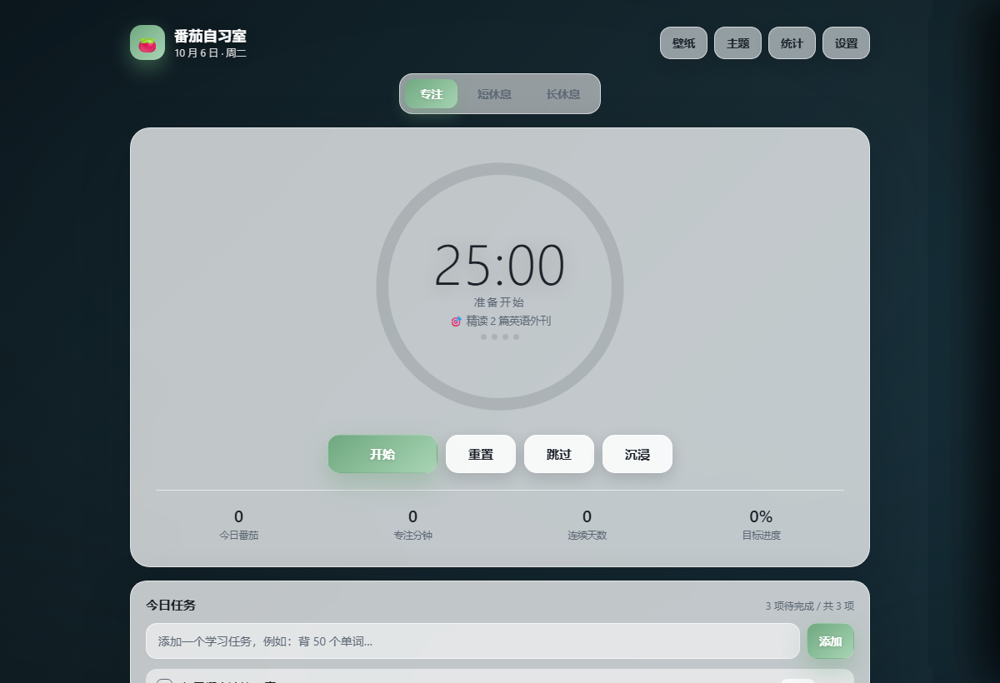
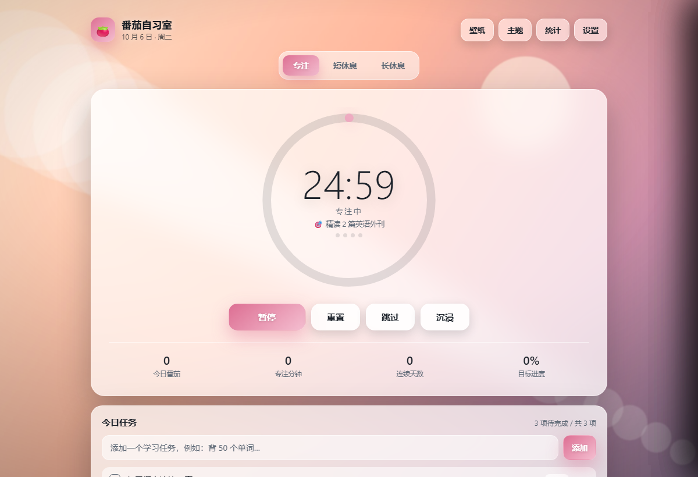
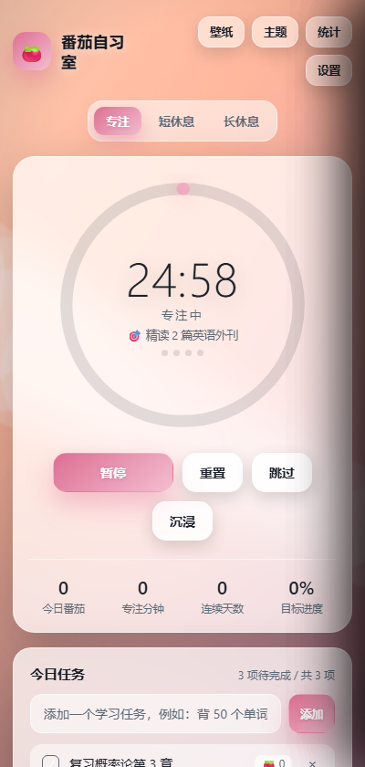

# 🍅 番茄自习室 · Study Pomodoro

> 一个可以自己换壁纸、换主题的番茄钟（自律学习计时器）。
> **单文件、零依赖、零安装**——一个 `index.html` 就是全部，双击即用，数据只存在你自己的浏览器里。



<p align="center">
  
  
</p>

更多截图：[主题面板](docs/screenshots/04-theme.png) · [壁纸面板](docs/screenshots/05-wallpaper.png) · [统计面板](docs/screenshots/06-stats.png) · [沉浸模式](docs/screenshots/07-immersive.png)

<!-- 推送到 GitHub 后，可以把下面这行的注释去掉（记得把 USER/REPO 换成你的仓库）：


-->

## 特性

**🖼 自定义壁纸**

- 上传本地图片（拖拽即可），或直接填图片链接
- 10 张内置渐变壁纸：极光、夜空、森林、深海、晨曦、蜜桃、纸质、素灰、薄荷、夜梅
- 铺满裁切 / 完整显示 / 平铺三种适应方式，背景模糊与遮罩深度可调
- 自动根据壁纸明暗调整文字颜色与遮罩，浅色壁纸不会让白色文字糊成一片
- 大图自动压缩后保存在本机，原图不会上传到任何服务器

**🎨 主题**

- 8 套主色 × 浅色 / 深色面板，实时预览
- 进度环、按钮、开关、图表、打卡热力图会一起换色

**⏱ 计时**

- 专注 / 短休息 / 长休息，时长与「每几轮长休息」都可调
- 专注结束自动进入休息，可选结束后自动开始下一个番茄
- 提示音（浏览器实时合成，不依赖音频文件）、可选滴答声、桌面通知、运行时自动防止息屏
- 沉浸模式（只留进度环）、全屏、标签页标题实时显示剩余时间

**📚 学习管理**

- 今日任务清单，可把某个任务设为当前专注目标，自动累计每个任务的番茄数与投入分钟
- 今日番茄 / 专注分钟 / 连续天数 / 目标进度
- 统计面板：最近 7 天柱状图、30 天打卡热力图、任务投入排行
- 数据可一键导出 / 导入，换设备或备份很方便

**🔒 隐私**

- 没有账号、没有后端、没有统计埋点
- 全部数据（设置、任务、专注记录、壁纸）都存在你自己浏览器的 localStorage / IndexedDB 中

## 快速开始

### 方式一：直接用（推荐新手）

下载 `index.html`，双击用浏览器打开即可。想更像一个 App，可以在浏览器里「添加到主屏幕」或按 `F` 全屏。

### 方式二：本地服务器（图片保留原图画质）

```bash
npm start          # 起一个本地服务器，默认 http://127.0.0.1:5173
```

没有装 npm 也没关系，直接用 Node 运行同样的脚本：

```bash
node tools/serve.mjs
```

### 方式三：在线使用（GitHub Pages）

仓库里已经带好自动部署配置，推到 GitHub 后：

1. 打开仓库 **Settings → Pages**；
2. 在 **Build and deployment → Source** 选择 **GitHub Actions**；
3. 推送到 `main` 分支（或手动触发 `Deploy to GitHub Pages` 这个 workflow）；
4. 稍等片刻，访问 `https://cloveerr426.github.io/study-pomodoro/`。

## 键盘快捷键

| 按键 | 功能 |
| --- | --- |
| `空格` | 开始 / 暂停 |
| `R` | 重置当前计时 |
| `S` | 跳过当前阶段 |
| `F` | 全屏 |
| `Esc` | 退出沉浸模式 / 关闭抽屉 |

## 项目结构

```
study-pomodoro/
├─ index.html                 # 应用本体（HTML + CSS + JS 全在这一个文件里）
├─ tests/                     # 零依赖端到端测试（Node 内置能力 + 本机浏览器）
│  ├─ lib/harness.mjs         # 测试工具库：静态服务 / 启动浏览器 / CDP / 截图分析
│  ├─ functional.mjs          # 62 项：计时、循环、任务、统计、主题、壁纸、持久化
│  ├─ local-file.mjs          # 13 项：file:// 直接打开时的存储降级路径
│  ├─ layout.mjs              # 49 项：多尺寸布局溢出与文字对比度审计
│  └─ screenshots.mjs         # 重新生成 docs/screenshots 里的截图
├─ tools/serve.mjs            # 本地静态服务器（npm start）
├─ docs/screenshots/          # README 用的截图
└─ .github/workflows/         # GitHub Pages 部署 + 测试
```

## 开发与测试

需要 **Node.js ≥ 22**（用到内置的 `fetch` 与 `WebSocket`）和本机已安装的 **Chrome / Edge**，
不需要 `npm install`——测试直接驱动真实浏览器，不引入任何第三方依赖。

```bash
npm test               # 依次跑三套测试，共 124 项检查
npm run test:functional
npm run test:layout
npm run shots          # 重新生成文档截图
```

不装 npm 也能跑（效果完全一样）：

```bash
node tests/functional.mjs
node tests/local-file.mjs
node tests/layout.mjs
node tests/screenshots.mjs
```

如果自动探测不到浏览器，用环境变量指定：

```bash
BROWSER="C:\\Program Files\\Google\\Chrome\\Application\\chrome.exe" npm test
# Linux / macOS
BROWSER=/usr/bin/google-chrome-stable npm test
```

测试做了什么：起一个本地静态服务器 → 用无头浏览器打开页面 → 通过 DevTools 协议真实点击按钮、
让计时器真的走秒、完成番茄、换壁纸换主题、刷新页面验证持久化 → 最后截图并用像素统计检查
文字对比度、元素溢出与重叠。CI 配置在 `.github/workflows/test.yml`。

## 想改点什么

都在 `index.html` 里，改完刷新即可：

| 想改的东西 | 位置 |
| --- | --- |
| 内置壁纸 | `WALLPAPERS` 数组（`css` 是背景，`luma` 是亮度 0–1，用于自动明暗适配） |
| 主题主色 | `THEMES` 数组 |
| 默认时长 / 目标 | `DEFAULTS` 对象 |
| 配色变量、圆角、模糊 | 文件开头的 CSS 变量（`--accent`、`--radius` 等） |
| 快捷键 | 搜索 `键盘快捷键` |

## 常见问题

**关闭页面后还在计时吗？**
不会。网页关闭后计时就停了，标签页保持在后台可以继续计时（切到别的窗口也有桌面通知提醒）。

**我上传的图片存在哪里？**
只存在你自己浏览器的本地数据库里（IndexedDB，超大或环境受限时自动改用 localStorage 压缩存储）。
换浏览器、换设备或清理浏览器数据后需要重新上传，记得用「导出数据」备份任务与记录。

**为什么我用 file:// 直接打开时，图片画质好像被压缩了？**
部分浏览器在本地文件模式下会禁用 IndexedDB，此时应用会把图片压缩后存入 localStorage 以保证能用。
想要保留原图画质，用 `npm start` 通过本地服务器打开，或直接部署到 GitHub Pages。

**会自动开始下一个番茄吗？**
默认「自动开始休息」开启、「自动开始专注」关闭，都可以在设置里改。

## 浏览器兼容

Chrome / Edge / Safari / Firefox 的桌面与移动版均可使用。
需要注意：桌面通知、防息屏、File System 相关能力在不同浏览器上支持程度不同，应用会静默降级。

## 贡献

欢迎 Issue 和 PR，请先看 [CONTRIBUTING.md](CONTRIBUTING.md)。

## 许可证

[MIT](LICENSE) —— 可自由使用、修改、商用，保留版权声明即可。

---

## English

**Study Pomodoro** — a single-file Pomodoro timer you can make your own.
Upload your own wallpaper (or paste an image URL), pick from 10 built-in gradient backgrounds,
and choose from 8 accent colors with light/dark panels. Wallpaper brightness is detected automatically
so text stays readable. Includes focus/short/long cycles, task list with per-task pomodoro counts,
7-day and 30-day stats, keyboard shortcuts, an immersive mode, and JSON export/import.

No build step, no dependencies, no backend: everything lives in `index.html`, and all data stays in
your own browser. `npm test` runs 124 end-to-end checks against a real headless browser. MIT licensed.
